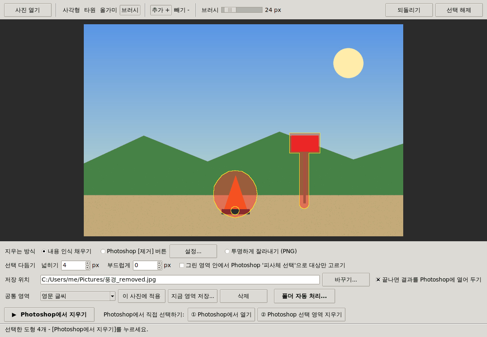

# PS Remover: 포토샵으로 사진 속 영역 지우기

Photoshop을 자동으로 실행해서 **사진을 열고, 지정한 영역을 선택하고, 그 부분을 지운 뒤, 결과를 새 파일로 저장**하는 도구입니다.

- 지우는 방식은 셋 중 하나를 고릅니다.
  - **내용 인식 채우기(Content-Aware Fill)**: 주변 내용으로 자연스럽게 채웁니다. 기본값입니다.
  - **Photoshop [제거] 버튼**: 선택 영역이 있을 때 작업 표시줄에 나오는 [제거] 버튼과 같은 AI 제거를 씁니다. 처음 한 번 동작 녹화가 필요합니다. ([아래](#photoshop-제거-버튼으로-지우기) 참고)
  - **투명하게 잘라내기**: 선택한 부분을 투명하게 만들고 PNG로 저장합니다.
- 원본 사진은 바뀌지 않습니다. 결과는 `사진이름_removed.jpg` 같은 새 파일로 저장됩니다.



## 주요 기능

- **사진 위에 지울 부분 그리기**: 사각형, 타원, 올가미, 브러시 도구와 추가/빼기, 되돌리기
- **버튼 한 번으로 처리**: Photoshop 실행 → 사진 열기 → 같은 영역 선택 → 지우기 → 저장 → 결과를 Photoshop에 열어 두기
- **선택 다듬기**: 넓히기(px)로 가장자리의 잔상까지 지우고, 부드럽게(페더)로 경계를 자연스럽게 합니다.
- **피사체 선택(AI)과 함께 쓰기**: 대충 그린 영역 안에서 Photoshop의 '피사체 선택'이 찾은 대상의 윤곽만 지웁니다.
- **Photoshop [제거] 버튼 쓰기**: 영역을 선택한 뒤, 녹화해 둔 동작으로 작업 표시줄의 [제거] 버튼을 누른 것과 같은 결과를 얻습니다.
- **Photoshop에서 직접 선택하기**: ① 사진을 Photoshop에서 열고, Photoshop의 선택 도구로 고른 뒤, ② 버튼을 누르면 지워집니다. 지우기는 한 단계로 기록되므로 Photoshop에서 Ctrl+Z 한 번으로 되돌릴 수 있습니다.
- **공통 영역**: 여러 사진에서 늘 같은 자리(워터마크, 날짜, 로고 등)를 지워야 할 때, 영역을 한 번 그려 이름을 붙여 저장해 두고 계속 다시 씁니다. 크기나 방향(가로/세로)이 다른 사진에서도 같은 모서리에 맞춰 놓입니다.
- **폴더 한꺼번에 처리**: 사진 폴더를 고르면 사진마다 공통 영역을 선택해 지웁니다. 이미 지운 사진은 건너뛰므로 새 사진이 생길 때마다 다시 실행하면 되고, 폴더 감시를 켜 두면 새 사진이 들어오는 대로 알아서 지웁니다.
- **명령줄(CLI)**: 좌표나 공통 영역으로 지우고, 폴더 처리와 폴더 감시도 명령 하나로 합니다.
- **Photoshop 스크립트(.jsx)로 내보내기**: 자동 실행이 막힌 컴퓨터에서는 Photoshop 메뉴에서 직접 실행할 수 있습니다.

## 준비물

| 항목 | 내용 |
| --- | --- |
| 운영체제 | Windows 10/11 또는 macOS |
| Photoshop | Adobe Photoshop CC 이상 (최신 버전 권장). '피사체 선택'은 CC 2018 이상 |
| Python | 3.8 이상. [python.org](https://www.python.org/downloads/) 설치본을 권장합니다 (Tkinter 포함). Windows에서는 설치할 때 **Add python.exe to PATH**를 체크하세요. |

## 설치와 실행

### 가장 간단한 방법

- **Windows**: `run_windows.bat`을 더블클릭합니다.
- **macOS**: `run_mac.command`를 더블클릭합니다. 처음에는 Finder에서 오른쪽 클릭 → **열기**를 선택해야 할 수 있습니다.

처음 실행하면 필요한 패키지(Pillow, Windows에서는 pywin32)를 설치하고 화면을 엽니다.

### 실행이 안 될 때

- **ZIP 압축을 먼저 푸세요.** ZIP 파일 안에서 바로 더블클릭하면 실행되지 않습니다. ZIP 파일을 오른쪽 클릭해 [압축 풀기](Windows: [모두 압축 풀기])를 한 뒤, 풀린 폴더 안의 파일을 실행하세요.
- **Windows 보안 경고**: "Windows의 PC 보호" 창이 뜨면 [추가 정보] → [실행]을, "게시자를 확인할 수 없습니다" 창이 뜨면 [실행]을 누르세요.
- **macOS 보안 경고**: "열 수 없습니다" 창이 뜨면 [완료]를 누른 뒤 **시스템 설정 > 개인정보 보호 및 보안** 아래쪽의 **[그래도 열기]** 를 누르고, run_mac.command를 다시 실행하세요.
- 그래도 안 되면 직접 실행하면 오류 내용이 보입니다.
  - **Windows**: 풀린 폴더를 열고, 탐색기 위쪽 주소창에 `cmd`를 입력한 뒤 Enter를 누릅니다. 열린 창에 아래 두 줄을 차례로 입력합니다. (`py`가 없다고 나오면 `py` 대신 `python`)
    ```
    py -m pip install Pillow pywin32
    py -m ps_remover
    ```
  - **macOS**: [응용 프로그램 > 유틸리티 > 터미널]을 열고 `cd `(cd와 빈칸)를 입력한 뒤, 풀린 폴더를 터미널 창에 끌어다 놓고 Enter를 누릅니다. 그다음 아래 두 줄을 입력합니다.
    ```
    python3 -m pip install --user Pillow
    python3 -m ps_remover
    ```

### 직접 설치

```bash
pip install -r requirements.txt
python -m ps_remover            # GUI 실행
```

또는 패키지로 설치하면 `ps-remover` 명령이 생깁니다.

```bash
pip install .
ps-remover                      # GUI 실행
```

> macOS의 Homebrew Python에서 `externally-managed-environment` 오류가 나면 가상 환경을 쓰세요.
> `python3 -m venv .venv && source .venv/bin/activate && pip install -r requirements.txt`
> Homebrew Python에는 Tkinter가 따로 필요합니다: `brew install python-tk`

## 사용법 (GUI)

1. **[사진 열기]** 로 사진을 고릅니다.
2. 도구를 골라 사진 위에 지울 부분을 그립니다. 선택한 부분은 빨갛게 표시됩니다.
   - **사각형(R)**, **타원(E)**: 드래그합니다. Shift를 누르면 정사각형이나 원이 됩니다.
   - **올가미(L)**: 지울 부분을 자유롭게 둘러쌉니다.
   - **브러시(B)**: 지울 부분을 칠합니다. `[` `]` 키로 브러시 크기를 바꿉니다.
   - **빼기**를 고른 뒤 그리면 그 부분은 선택에서 빠집니다.
   - 되돌리기는 Ctrl+Z (macOS는 Cmd+Z)입니다.
3. 필요하면 옵션을 바꿉니다.
   - **넓히기**: 선택 영역을 몇 픽셀 넓힌 뒤 지웁니다. 물체 가장자리가 남으면 값을 키우세요. 기본값은 4입니다.
   - **부드럽게**: 경계를 부드럽게 합니다.
   - **피사체 선택**: 그린 영역 안에서 Photoshop이 찾은 대상(사람, 물건)만 지웁니다.
4. **[▶ Photoshop에서 지우기]** 를 누릅니다. Photoshop이 실행되어 작업하고, 결과를 저장한 뒤 Photoshop에 열어 둡니다.

Photoshop의 선택 도구(개체 선택, 빠른 선택 등)를 쓰고 싶다면 **[① Photoshop에서 열기]** 를 누르고, Photoshop에서 지울 부분을 선택한 뒤 **[② Photoshop 선택 영역 지우기]** 를 누르세요. 사진 위에 영역을 그려 두었다면 ①을 눌렀을 때 그 영역이 선택된 채로 열리므로, Photoshop 작업 표시줄의 [제거] 버튼을 바로 누를 수도 있습니다.

**[파일] 메뉴**에서 선택 영역을 저장하거나 불러올 수 있고, Photoshop 스크립트(.jsx)로 내보낼 수도 있습니다.

## 여러 사진에서 같은 자리 지우기 (공통 영역)

워터마크, 날짜, 로고처럼 **사진마다 같은 자리에 있는 것** 을 계속 지워야 할 때 씁니다. 영역은 한 번만 그리고, 그다음부터는 폴더만 고르면 됩니다.

### 1. 공통 영역 만들기 (한 번만)

1. [사진 열기]로 기준이 될 사진을 열고, 지울 영역을 그립니다.
2. 아래쪽 **공통 영역** 줄의 **[지금 영역 저장...]** 을 누르고 이름(예: `워터마크`)을 붙입니다.
3. 크기나 방향이 다른 사진에서 영역을 어디에 놓을지 고릅니다.
   - **기준 위치에 맞추기** (기본값): 영역이 가까운 모서리(예: 오른쪽 아래)에서 떨어진 거리를 지킵니다. 세로 사진이나 크기가 다른 사진에서도 같은 모서리에 놓이므로 워터마크나 날짜에 알맞습니다. 기준 위치는 그린 자리를 보고 자동으로 정해지고, 바꿀 수도 있습니다.
   - **사진 크기에 비례해서 늘리기**: 가로와 세로를 사진 크기에 맞춰 각각 늘리거나 줄입니다.
   - **크기나 가로세로 비율이 같은 사진에만 쓰기**: 다른 비율의 사진은 처리하지 않고 오류로 알려 줍니다.

다른 사진을 연 뒤 공통 영역을 고르고 **[이 사진에 적용]** 을 누르면, 그 사진의 어디에 놓이는지 미리 볼 수 있습니다.

### 2. 폴더의 사진 지우기 (필요할 때마다)

1. **[여러 사진 한꺼번에 지우기...]** 를 누릅니다.
2. 공통 영역과 **사진 폴더** 를 고르고 **[시작]** 을 누릅니다. 결과는 사진 폴더 안의 `지운 사진` 폴더에 저장됩니다 (저장 폴더를 따로 고를 수도 있습니다).
3. 지우는 방식(내용 인식 채우기, Photoshop [제거] 버튼, 투명하게)과 넓히기 값은 메인 창의 설정을 따릅니다.

- **이미 지운 사진은 건너뜁니다.** 저장 폴더에 결과가 있는 사진은 다시 처리하지 않으므로, 새 사진이 생길 때마다 [시작]만 다시 누르면 새 사진만 지웁니다.
- **폴더 감시**: "새 사진이 들어오면 자동으로 지우기"를 켜고 시작하면, 창을 열어 두는 동안 사진 폴더를 계속 확인하다가 새 사진이 들어오는 대로 지웁니다. 복사 중인 파일은 복사가 끝난 뒤 처리합니다.
- 고른 폴더와 설정은 기억해 두므로 다음에는 창을 열고 [시작]만 누르면 됩니다.
- 한 장이 실패해도 나머지는 계속 처리하고, 실패한 사진은 기록에 이유와 함께 남습니다.

### 명령줄로 하기

```bash
ps-remover presets                                   # 저장된 공통 영역 보기
ps-remover batch 사진폴더 --preset 워터마크            # 새 사진만 지우기 → 사진폴더/지운 사진
ps-remover batch 사진폴더 --preset 워터마크 --method action --watch   # [제거] 버튼으로, 새 사진이 올 때마다 계속
ps-remover open 사진.jpg --preset 워터마크             # Photoshop에서 열고 공통 영역을 선택해 두기
```

공통 영역은 Windows에서는 `%APPDATA%\ps-remover\presets`, macOS에서는 `~/Library/Application Support/ps-remover/presets` 폴더에 JSON 파일로 저장됩니다.

## 사용법 (명령줄)

좌표는 **픽셀** 단위이고 (0, 0)은 사진의 **왼쪽 위**입니다. 사각형과 타원은 `X,Y,너비,높이`로 씁니다.
Photoshop에서 사각형 선택 도구로 드래그하면 정보 패널에 X, Y, W, H가 표시됩니다.

```bash
# 사각형 영역을 내용 인식 채우기로 지우기 → 사진_removed.jpg
ps-remover remove 사진.jpg --rect 120,80,300,200

# 여러 도형 섞기 (타원, 다각형)
ps-remover remove 사진.jpg --ellipse 50,60,40,40 --polygon "10,10 90,15 60,80"

# 투명하게 잘라내서 PNG로 저장, 선택 영역은 10픽셀 넓히기
ps-remover remove 사진.jpg --rect 0,0,200,100 --method transparent --expand 10

# 사진 속 주요 대상(피사체)을 찾아 지우기
ps-remover remove 인물.jpg --subject

# 같은 위치의 워터마크를 여러 사진에서 지우기 (GUI에서 저장한 공통 영역 사용)
ps-remover remove "사진/*.jpg" --preset 워터마크 --output-dir 결과

# Photoshop 작업 표시줄의 [제거] 버튼으로 지우기 (동작 녹화 필요, 아래 참고)
ps-remover check-action
ps-remover remove 사진.jpg --rect 120,80,300,200 --method action

# Photoshop에서 사진 열기 (영역을 주면 선택까지) / Photoshop에서 직접 선택한 영역 지우기
ps-remover open 사진.jpg --rect 120,80,300,200
ps-remover remove-selection --output 결과.png
```

`python -m ps_remover remove ...`처럼 실행해도 됩니다. 모든 옵션은 `ps-remover remove --help`로 볼 수 있습니다.

| 옵션 | 설명 |
| --- | --- |
| `--rect`, `--ellipse` `X,Y,W,H` | 사각형, 타원 영역. 여러 번 쓸 수 있습니다. |
| `--polygon "X,Y X,Y ..."` | 다각형 영역 (꼭짓점 3개 이상) |
| `--preset 이름` | GUI에서 저장한 공통 영역 (`ps-remover presets`로 목록 보기) |
| `--selection 파일.json` | 선택 영역 파일 ([파일 > 선택 영역 저장]) |
| `--subject` | Photoshop '피사체 선택'. 영역과 함께 쓰면 그 안의 피사체만 지웁니다. |
| `--method content-aware\|action\|transparent` | 내용 인식 채우기 (기본값), 녹화한 동작 실행 ([제거] 버튼), 투명하게 잘라내기 |
| `--action-set 세트`, `--action 동작` | `--method action`으로 실행할 동작 (기본값: `ps-remover` 세트의 `제거`) |
| `--expand PX`, `--feather PX` | 선택 영역 넓히기 (기본값 4), 가장자리 부드럽게 (기본값 0) |
| `-o 파일`, `--output-dir 폴더`, `--suffix` | 저장 위치와 이름. 기본값은 원본 옆의 `이름_removed.확장자`이며, 이미 있으면 `_2`, `_3`…을 붙입니다. |
| `--overwrite` | 같은 이름의 파일을 덮어씁니다. 원본에 덮어쓸 때도 필요합니다. |
| `--no-keep-open` | 결과를 Photoshop에 열어 두지 않습니다. 사진이 여러 장이면 이것이 기본값입니다. |
| `--export-jsx 파일.jsx` | Photoshop을 실행하지 않고 스크립트 파일만 만듭니다. |
| `batch`의 `--reprocess`, `--watch`, `--interval 초` | 이미 지운 사진도 다시 처리 / 폴더를 계속 감시 (Ctrl+C로 끝내기) / 확인 간격 (기본값 10초) |
| `--photoshop "Adobe Photoshop 2025"` | macOS에서 Photoshop이 여러 버전 설치되어 있을 때 사용할 앱을 고릅니다. |
| `--json` | 결과를 JSON으로 출력합니다. |

저장 형식은 JPG, PNG, TIFF, PSD입니다. 원본 형식으로 저장할 수 없을 때(HEIC, GIF 등)는 JPG로, 투명하게 잘라낼 때는 PNG로 저장합니다.

### 선택 영역 파일 형식

GUI의 **[파일 > 선택 영역 저장]** 으로 만들 수 있고, 직접 써도 됩니다. 공통 영역도 같은 형식입니다. `image_size`는 영역을 그린 사진의 크기이고, `fit`은 크기가 다른 사진에 놓는 방법입니다: `anchor`(`anchor` 위치 기준, `[0, 0]` 왼쪽 위 ~ `[1, 1]` 오른쪽 아래), `stretch`(비례해서 늘리기), `exact`(같은 비율만, 기본값).

```json
{
  "version": 1,
  "image_size": [4000, 3000],
  "fit": "anchor",
  "anchor": [1, 1],
  "shapes": [
    {"type": "rect", "mode": "add", "box": [3500, 2800, 3980, 2980]},
    {"type": "ellipse", "mode": "add", "box": [100, 100, 300, 250]},
    {"type": "polygon", "mode": "add", "points": [[10, 10], [90, 15], [60, 80]]},
    {"type": "brush", "mode": "subtract", "points": [[400, 400], [520, 460]], "radius": 15}
  ]
}
```

`box`는 `[왼쪽, 위, 오른쪽, 아래]`입니다. `mode`는 `add`(추가) 또는 `subtract`(빼기)입니다.

## Photoshop [제거] 버튼으로 지우기

Photoshop에서 영역을 선택하면 작업 표시줄에 **[생성형 채우기]** 와 함께 **[제거]** 버튼이 나옵니다. 이 버튼은 제거 도구와 같은 AI로 선택한 부분을 지우고, 결과를 새 레이어로 만듭니다. Adobe에 따르면 생성형 크레딧은 쓰지 않습니다.

Photoshop 스크립트에는 이런 작업 표시줄 버튼을 누르는 기능이 없습니다. 대신 **[제거] 버튼 누르기를 Photoshop 동작(Action)으로 한 번 녹화**해 두면, 이 도구가 영역을 선택한 뒤 그 동작을 실행합니다.

### 한 번만 하는 준비: 동작 녹화

1. 지울 부분이 선택된 사진을 Photoshop에 띄웁니다. 이 도구에서 사진을 열고 영역을 그리거나 공통 영역을 **[이 사진에 적용]** 한 뒤 **[① Photoshop에서 열기]** 를 누르면, 사진이 열리고 그 영역이 선택됩니다. (명령줄: `ps-remover open 사진.jpg --preset 워터마크`)
2. Photoshop 맨 위 메뉴에서 **[창 > 동작]** 을 누릅니다. 단축키는 Windows에서 **Alt+F9**, macOS에서 **Option+F9** 입니다 (노트북에서 F9가 밝기·음량 키로 동작하면 fn도 함께 누르세요). 동작 패널이 버튼만 보이는 모양이면 패널 오른쪽 위 메뉴(≡)에서 **단추 모드** 를 꺼야 녹화할 수 있습니다.
3. 동작 패널 아래의 **폴더 아이콘(새 세트 만들기)** 을 눌러 세트 이름을 `ps-remover`로 합니다.
4. 그 세트를 고른 채 **+ 아이콘(새 동작 만들기)** 을 누르고, 이름을 `제거`로 한 뒤 **[기록]** 을 누릅니다.
5. 작업 표시줄의 **[제거]** 버튼을 누르고, 결과가 나오면 동작 패널의 **정지(■)** 버튼을 누릅니다.
6. 동작 패널의 `제거` 동작 아래에 단계가 하나 생겼는지 확인합니다.

GUI의 [설정...] 창에서 **[Photoshop에서 확인]** 을 누르거나 `ps-remover check-action`을 실행하면, 이 도구가 동작을 찾을 수 있는지 알려 줍니다.

### 사용

- **GUI**: 지우는 방식에서 **Photoshop [제거] 버튼** 을 고른 뒤 평소처럼 [Photoshop에서 지우기]를 누릅니다.
- **명령줄**: `--method action`을 붙입니다. 다른 이름으로 녹화했다면 `--action-set`, `--action`으로 지정합니다.

### 알아 둘 점

- 녹화 중에 [제거]를 눌렀는데 동작 패널에 단계가 생기지 않으면, 그 Photoshop 버전은 이 버튼을 동작으로 녹화할 수 없습니다. 이때는 **내용 인식 채우기** 를 쓰세요.
- [제거] 버튼은 Adobe의 AI 기능이라 인터넷 연결과 Adobe 로그인이 필요할 수 있습니다.
- [제거] 대신 **생성형 채우기** 나 다른 작업을 녹화해도 됩니다. 이 도구는 선택 영역을 만든 뒤 녹화된 동작을 그대로 실행합니다.
- 결과는 새 레이어로 만들어집니다. JPG와 PNG는 합쳐진 모습으로 저장되고, PSD와 TIFF는 레이어가 그대로 남습니다.

## 동작 방식

```
GUI / 명령줄 (Python)
   │  선택 영역과 옵션을 담은 Photoshop 스크립트(JSX)를 만든다
   ▼
Windows: COM (Photoshop.Application)      macOS: AppleScript "do javascript"
   │  Photoshop이 꺼져 있으면 실행한다
   ▼
Photoshop (ps_remover/jsx/ps_remover.jsx)
   사진 열기 → 선택 영역 만들기 → 넓히기/페더 → 내용 인식 채우기 (또는 녹화한 동작, 투명하게 지우기)
   → 새 파일로 저장 → 결과 열기 → 결과(JSON)를 돌려준다
```

- 사진이 이미 Photoshop에 열려 있으면 **복사본**에서 작업하므로, 열려 있던 문서와 저장하지 않은 변경 사항은 건드리지 않습니다.
- 작업 중에는 눈금자 단위를 픽셀로 바꾸고 대화상자가 뜨지 않게 합니다. 끝나면 원래 설정으로 돌려놓습니다.
- 해상도가 72ppi가 아닌 사진도 좌표가 어긋나지 않도록 72ppi에서 선택합니다. 픽셀은 그대로이고, 저장할 때는 원래 해상도로 돌려놓습니다.
- 여러 레이어가 있는 파일은 보이는 레이어를 하나로 합친 뒤 작업합니다. 원본 파일은 바뀌지 않습니다.
- 휴대폰 사진의 회전 정보(EXIF)는 Photoshop과 똑같이 적용해서 미리 보여 주므로, 그린 위치와 지워지는 위치가 같습니다.

## 문제 해결

| 증상 | 해결 방법 |
| --- | --- |
| macOS: "Photoshop 제어를 막았습니다" | **시스템 설정 > 개인정보 보호 및 보안 > 자동화**에서 이 도구를 실행한 앱(터미널 등)의 **Adobe Photoshop** 항목을 켜세요. |
| Windows: "Photoshop을 찾을 수 없습니다" | Photoshop을 한 번 직접 실행한 뒤 다시 시도하세요. 그래도 안 되면 Photoshop을 다시 설치해 자동화(COM) 등록을 복구하세요. |
| "Photoshop이 응답하지 않습니다" | Photoshop에 열린 대화상자(업데이트 알림, 로그인 등)가 있으면 닫고 다시 시도하세요. |
| 미리보기가 안 됨 (RAW, HEIC 등) | HEIC는 `pip install pillow-heif`로 미리 볼 수 있습니다. RAW 파일은 **① Photoshop에서 열기**로 연 뒤 Photoshop에서 선택하세요. |
| 지운 자리가 어색함 | **넓히기** 값을 키우거나 영역을 조금 더 넉넉하게 그리세요. 결과는 Photoshop에 열려 있으므로 제거 도구나 복구 브러시로 바로 다듬을 수 있습니다. |
| "Photoshop 동작 'ps-remover > 제거'을(를) 찾을 수 없습니다" | [Photoshop [제거] 버튼으로 지우기](#photoshop-제거-버튼으로-지우기)의 방법대로 동작을 녹화하세요. 세트와 동작 이름이 정확히 같아야 합니다. |
| 공통 영역이 엉뚱한 자리에 놓임 | [이 사진에 적용]으로 위치를 확인하고, 공통 영역을 다시 저장하면서 **기준 위치** 나 맞추는 방법을 바꾸세요. |
| 폴더 처리에서 "새로 지울 사진이 없습니다" | 저장 폴더에 결과가 이미 있는 사진은 건너뜁니다. 다시 지우려면 결과 파일을 지우거나 명령줄에서 `--reprocess`를 쓰세요. |
| 오류 뒤에 사진이 Photoshop에 남아 있음 | 일부러 열어 둔 것입니다. 선택 영역이 그대로 있으니 Photoshop에서 직접 마무리할 수 있습니다. |

## 개발

```bash
pip install -e ".[test]"
python -m pytest
```

- Photoshop 스크립트 테스트는 실제 Photoshop 대신, Node.js로 만든 가짜 Photoshop(`tests/jsx/mock_photoshop.js`)에서 실행합니다. Node.js가 없으면 이 테스트는 건너뜁니다.
- Photoshop의 스크립트 엔진(ExtendScript)은 ECMAScript 3이라서, 가짜 Photoshop은 ES5 이후 기능(`forEach`, `JSON` 등)을 지운 상태로 스크립트를 실행합니다. `npm install --prefix tests/jsx`로 acorn을 설치하면 ES3 문법 검사도 함께 합니다.
- GUI 테스트는 화면(디스플레이)이 있을 때만 실행됩니다. Linux에서는 `xvfb-run python -m pytest`로 실행할 수 있습니다.

```
ps_remover/
  gui.py              Tkinter 화면
  cli.py              명령줄
  api.py              작업 단위 (지우기, 열기, 현재 선택 영역 지우기)
  batch.py            폴더 처리와 폴더 감시
  settings.py         공통 영역과 설정 저장
  shapes.py           선택 도형, 공통 영역, 크기가 다른 사진에 맞추기
  script.py           Photoshop 스크립트 생성
  photoshop.py        Photoshop 실행 (Windows COM, macOS AppleScript)
  jsx/ps_remover.jsx  Photoshop 안에서 실행되는 스크립트
tests/                단위 테스트와 가짜 Photoshop
```
